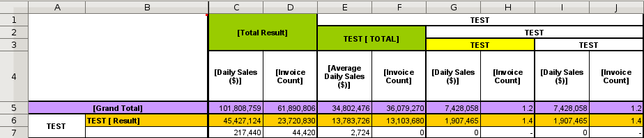
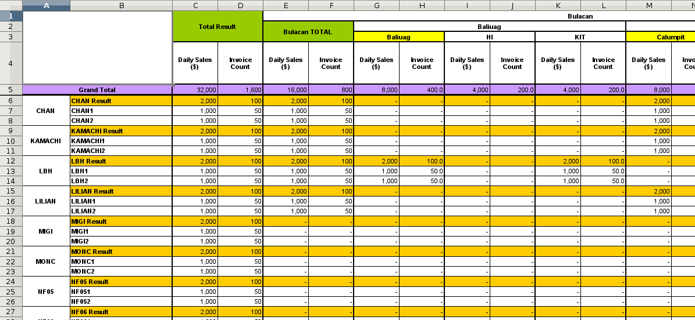

.. highlight:: rst

=======================================================================================
A tool for generating an xlsx file from a crosstabulated hierarchical Pandas DataFrame.
=======================================================================================

-----------------
Setting up Tryp
-----------------

* Manually install numpy:

.. code-block :: python

    pip install numpy

* Do installation. This will pull down all the requirements 

.. code-block :: python

    python setup.py install
    
* Running tests

.. code-block :: python

   python setup.py nosetests
   
* From an excel template file:

   

* Output would be like this:

   

.. image:: https://travis-ci.org/ogiaquino/tryp.png
        :target: https://travis-ci.org/ogiaquino/tryp
        
 
       
